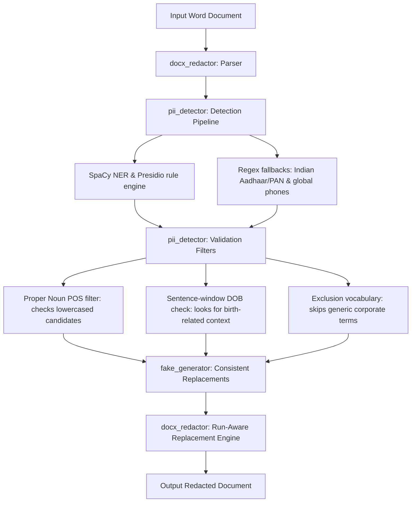

# PII Redaction Tool

This tool detects and redact personally identifiable information (PII) from Word documents (`.docx`). It replaces sensitive elements with realistic, consistent fake values while preserving formatting (bolding, italics, colors, headers, footers, and tables).

## Setup Instructions

1. Install Python packages:
   ```bash
   pip install python-docx spacy presidio-analyzer faker
   ```

2. Download the SpaCy language model:
   ```bash
   python -m spacy download en_core_web_lg
   ```

## Usage

### 1. Execute Redaction
Run the following command to redact a document:
```bash
python src/redact.py --input "Red Herring Prospectus.docx" --output "Redacted_Red_Herring_Prospectus.docx"
```

Command options:
* `--input`: Path to input docx file (default: `Red Herring Prospectus.docx`).
* `--output`: Path to save redacted file (default: `Redacted_Red_Herring_Prospectus.docx`).

### 2. Run Metrics Evaluation
To run the automated evaluation script against the test suite:
```bash
python src/evaluate.py
```

---

## Technical Architecture



### Key Engineering Details

1. **Hybrid Detection Engine**: Combines SpaCy NER and Microsoft Presidio with regex checkers for localized identity tokens (PAN and Aadhaar numbers).
2. **Proper Noun POS Filter**: Standard capitalized regex check often matches general document text (e.g., "Qualified Institutional Buyers", "Weighted Average Cost"). To resolve this, the detector parses candidates in lowercase using SpaCy's POS tagger. If the phrase contains no proper nouns (PROPN) in lowercase context, it is discarded.
3. **Sentence-Aware Date Check**: Filters out general timeline dates (e.g., "dated September 10, 2025" or "Companies Act, 2013") by redacting dates only if keywords like "born", "birth", "DOB", or "age" appear in the same sentence boundary.
4. **Deterministic Replacements**: Uses a central key-value mapping to replace identical PII occurrences with the same fake value across the document.
5. **Run-level Substitution**: Substitutes characters inside paragraph runs from right to left to avoid breaking Microsoft Word's XML formatting nodes.

---
