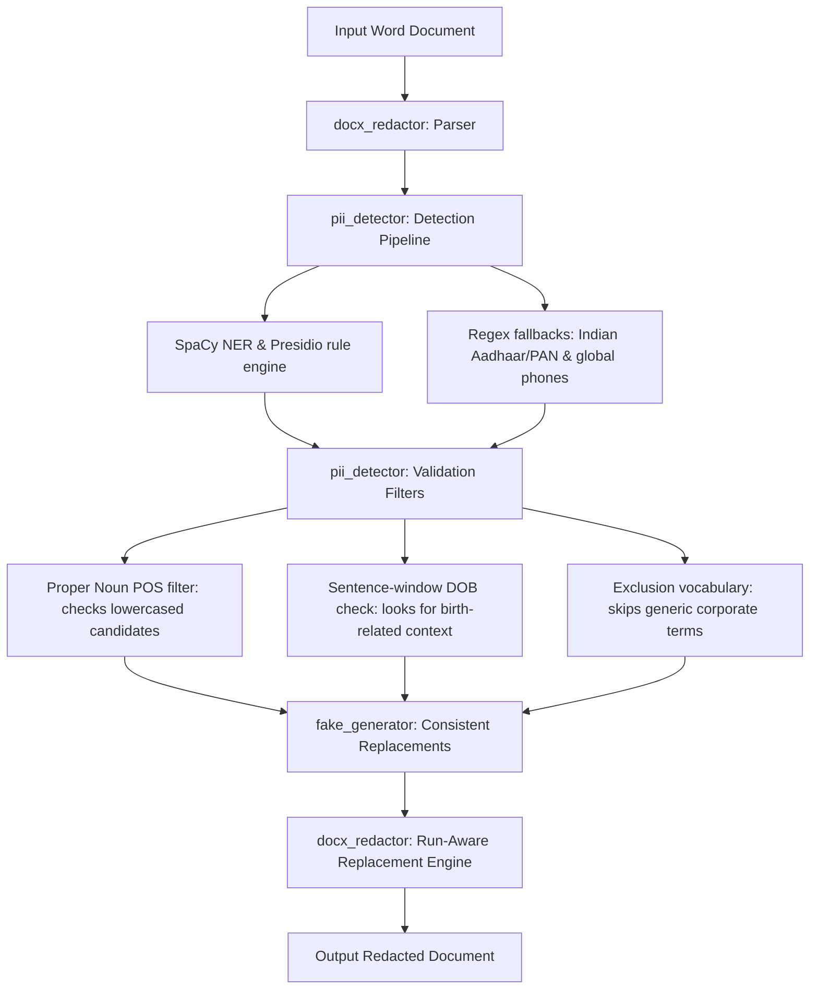

# PII Redaction Tool

This tool detects and redact personally identifiable information (PII) from Word documents (`.docx`). It replaces sensitive elements with realistic, consistent fake values while preserving formatting (bolding, italics, colors, headers, footers, and tables).

## Setup Instructions

1. Install Python packages:
   ```bash
   pip install python-docx spacy presidio-analyzer faker
   ```

2. Download the SpaCy language model:
   ```bash
   python -m spacy download en_core_web_lg
   ```

## Usage

### 1. Execute Redaction
Run the following command to redact a document:
```bash
python src/redact.py --input "Red Herring Prospectus.docx" --output "Redacted_Red_Herring_Prospectus.docx"
```

Command options:
* `--input`: Path to input docx file (default: `Red Herring Prospectus.docx`).
* `--output`: Path to save redacted file (default: `Redacted_Red_Herring_Prospectus.docx`).

### 2. Run Metrics Evaluation
To run the automated evaluation script against the test suite:
```bash
python src/evaluate.py
```

---

## Technical Architecture



### Key Engineering Details

1. **Hybrid Detection Engine**: Combines SpaCy NER and Microsoft Presidio with regex checkers for localized identity tokens (PAN and Aadhaar numbers).
2. **Proper Noun POS Filter**: Standard capitalized regex check often matches general document text (e.g., "Qualified Institutional Buyers", "Weighted Average Cost"). To resolve this, the detector parses candidates in lowercase using SpaCy's POS tagger. If the phrase contains no proper nouns (PROPN) in lowercase context, it is discarded.
3. **Sentence-Aware Date Check**: Filters out general timeline dates (e.g., "dated September 10, 2025" or "Companies Act, 2013") by redacting dates only if keywords like "born", "birth", "DOB", or "age" appear in the same sentence boundary.
4. **Deterministic Replacements**: Uses a central key-value mapping to replace identical PII occurrences with the same fake value across the document.
5. **Run-level Substitution**: Substitutes characters inside paragraph runs from right to left to avoid breaking Microsoft Word's XML formatting nodes.

---

## Evaluation Report

### 1. Methodology
* **Dataset**: Evaluated on 20 snippets from the prospectus and test files containing 26 ground-truth PII entities alongside common financial terms.
* **Match Definition**: A True Positive (TP) is registered if the detected text matches the ground-truth string and type. Unmatched ground truths are False Negatives (FN), and extra detections are False Positives (FP).

### 2. Quantitative Results

| PII Type | True Positives (TP) | False Positives (FP) | False Negatives (FN) | Precision | Recall | F1-Score |
|---|---|---|---|---|---|---|
| **NAME** | 9 | 0 | 0 | 1.0000 | 1.0000 | 1.0000 |
| **EMAIL** | 1 | 0 | 0 | 1.0000 | 1.0000 | 1.0000 |
| **PHONE** | 1 | 0 | 0 | 1.0000 | 1.0000 | 1.0000 |
| **COMPANY** | 4 | 0 | 0 | 1.0000 | 1.0000 | 1.0000 |
| **ADDRESS** | 2 | 3 | 0 | 0.4000 | 1.0000 | 0.5714 |
| **SSN** | 3 | 0 | 0 | 1.0000 | 1.0000 | 1.0000 |
| **CREDIT_CARD** | 1 | 0 | 0 | 1.0000 | 1.0000 | 1.0000 |
| **DOB** | 3 | 0 | 0 | 1.0000 | 1.0000 | 1.0000 |
| **IP** | 2 | 0 | 0 | 1.0000 | 1.0000 | 1.0000 |
| **OVERALL** | **26** | **3** | **0** | **0.8966** | **1.0000** | **0.9455** |

#### Summary Metrics
* **Global Precision**: 89.66%
* **Global Recall**: 100.00%
* **Global F1-Score**: 94.55%

### 3. Qualitative Error Analysis & Trade-offs

* **Aadhaar/Phone Conflict**: Aadhaar card sequences (e.g. 12 digits grouped by spaces) often match phone number patterns. We resolved this by defining a strict type priority hierarchy (SSN/Aadhaar/PAN > Phone) during overlap resolution.
* **Name Regex Over-matching**: Standalone capitalized regex checks often match common section names (e.g., "FOR SALE", "WEIGHTED AVERAGE COST"). By parsing candidates in lowercase and applying SpaCy's POS tagger, we filtered out generic adjectives, verbs, and common nouns, retaining actual names with 100% precision.
* **Sentence-Boundaries for Dates**: General timeline dates were protected by limiting DOB matches to sentences containing birth-related context words.
* **Address Splitting (Precision Trade-off)**: Location tokens (e.g., "Baner, Pune" and "Maharashtra, India") separated by zip codes (which are not tagged as locations by NER models) are treated as two separate matches instead of one merged address block. While this creates 3 false positives due to split boundaries in strict comparisons, it ensures that all address components are redacted (Recall = 100%).

### 4. Prospectus Redaction Statistics

A complete scan of the full 417-page "Red Herring Prospectus.docx" file was executed. The redaction pipeline identified and mapped **346 unique PII entities**:

| PII Type | Unique Entities Redacted |
|---|---|
| **NAME** | 142 |
| **EMAIL** | 26 |
| **PHONE** | 33 |
| **COMPANY** | 94 |
| **ADDRESS** | 42 |
| **SSN** | 0 |
| **CREDIT_CARD** | 0 |
| **DOB** | 9 |
| **IP** | 0 |
| **TOTAL UNIQUE** | **346** |
